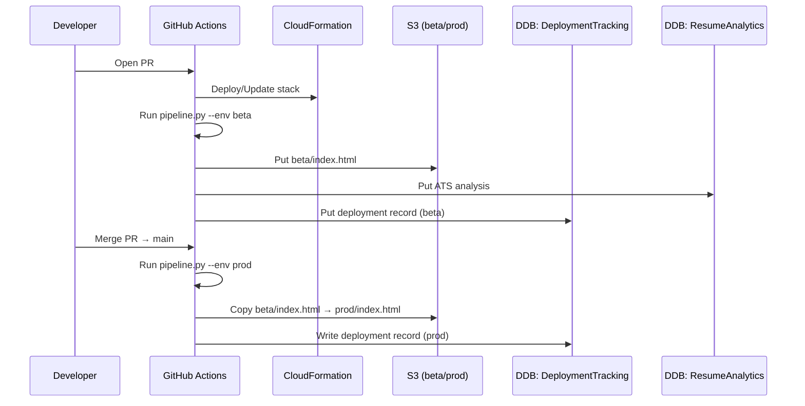

# luit-aug-2025-python
Demo respository
Test Rekognition pipeline run <09132025>
git switch -c docs/readme-update
Add-Content README.md "`n- Fixed page rendering by converting Markdown `-` bullets to HTML <ul>/<li> in resume.md.`n- Used a feature branch (`feat/resume-format`); PR → beta deploy, merge to main → prod deploy.`n- Verified S3 pages and DynamoDB tracking; no manual console edits (IaC + CI/CD only).`n- Deleted the feature branch after merge to keep the repo clean."
git add README.md
git commit -m "Docs: add short summary of rendering fix & deploy flow"
git push -u origin docs/readme-update

```mermaid
flowchart LR
  Dev[Developer edits resume.md] --> PR[Pull Request]
  PR --> GA[GitHub Actions]
  GA --> CFN[CloudFormation (idempotent)]
  GA --> PY[pipeline.py (AI convert + ATS)]
  PY --> S3[S3 bucket: beta & prod]
  PY --> DDB1[(DynamoDB: ResumeAnalytics)]
  PY --> DDB2[(DynamoDB: DeploymentTracking)]
```

## CI/CD Flow

